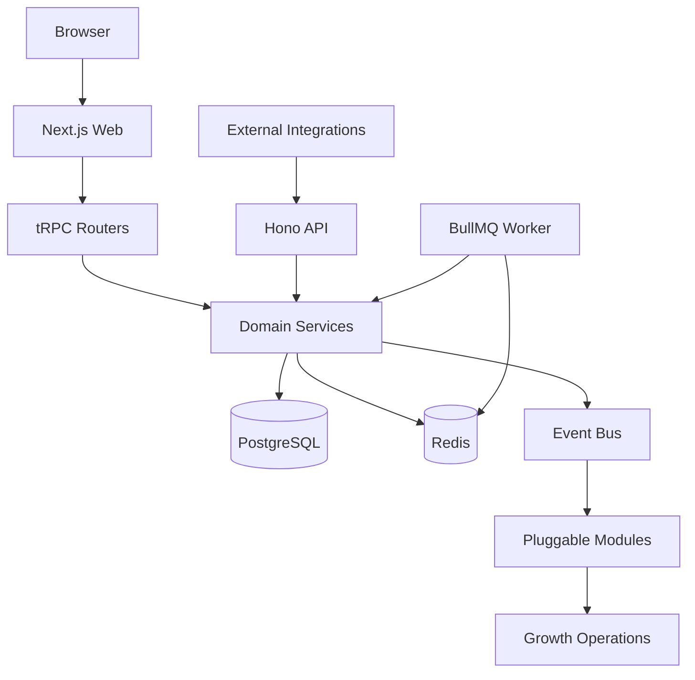
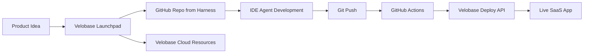

# Velobase Harness

**Read this in other languages:** [Simplified Chinese](./README.zh-CN.md)

An AI SaaS application harness for going from idea to production: T3 Stack foundation, billing, payments, background jobs, growth integrations, and a Cloud deployment path built for Velobase Launchpad.

[](https://nextjs.org)
[](https://react.dev)
[](https://www.typescriptlang.org)
[](https://pnpm.io)
[](#license)

## Why Velobase Harness

Velobase Harness is not a blank starter. It is a product-ready base for AI SaaS teams that want the common infrastructure to be solved before the first product-specific feature is written.

- **Modern T3 foundation:** Next.js 15, React 19, TypeScript, tRPC, Prisma, NextAuth, Tailwind CSS, and pnpm.
- **Three-service runtime:** run Web, Hono API, and BullMQ Worker together for small deployments or split them with `SERVICE_MODE` for production.
- **Pluggable modules:** Google Ads, PostHog, Lark, Telegram, NowPayments, Affiliate, Touch, and AI Chat can be enabled by environment variables.
- **Billing and credits:** order, subscription, credit ledger, fulfillment, cashflow, promo, and `@velobaseai/billing` integration are already wired.
- **Payment-ready:** Stripe and NowPayments flows include webhooks, renewal handling, refunds, disputes, and compensation jobs.
- **AI Chat module:** reusable chat, model config, tool calling, and business-tool extension points.
- **Worker queues:** BullMQ processors handle payment reconciliation, order compensation, touch delivery, subscription credits, support sync, and ad uploads.
- **Growth operations:** PostHog analytics, Google Ads offline conversion uploads, Affiliate/Referral, lifecycle Touch, Daily Bonus retention, Promo Code, SEO, and Launchpad conversion paths.
- **Production docs:** Docker, Kubernetes, GitOps, Cloud Deploy API, online-to-local debugging, and AI completion checklists.

## Quick Start

### Option A: Self-hosted local development

```bash
pnpm install
cp .env.example .env
pnpm docker:db:up
pnpm db:push
pnpm db:seed
pnpm dev:all
```

`pnpm dev:all` starts the combined local runtime: Web on `:3000`, API on `:3002`, and Worker on `:3001`.

You can also split processes across terminals:

```bash
pnpm dev
pnpm api:dev
pnpm worker:dev
```

### Option B: Deploy with Velobase Cloud

Velobase Cloud uses this repository as the default application template for Launchpad-created projects.

1. Create a project in Velobase Cloud or start from Launchpad.
2. Cloud creates a GitHub repository from the `velobase-harness` template and provisions PostgreSQL, Redis, R2, Kubernetes resources, domain, and deploy API credentials.
3. Add `VELOBASE_API_KEY` to GitHub Actions secrets.
4. Push to `main`.
5. GitHub Actions calls `GET https://api.velobase.cloud/api/v1/deploy/config`, builds and pushes the Docker image, then calls `POST https://api.velobase.cloud/api/v1/deploy`.
6. Visit `https://{subdomain}.velobase.app` after deployment succeeds.

Application requirements for Cloud deployment:

- A root `Dockerfile`
- HTTP listening on port `3000`
- Environment variables read from runtime env
- Prisma migration through `prisma migrate deploy`
- A `GET /healthz` readiness endpoint

## Architecture



The same codebase can run as one process or as separate services:

| Runtime | Entry | Port | Command |
| --- | --- | --- | --- |
| Web | Next.js App Router | `3000` | `pnpm dev` / `pnpm start` |
| API | Hono HTTP service | `3002` | `pnpm api:dev` / `pnpm api:prod` |
| Worker | BullMQ processors | `3001` | `pnpm worker:dev` / `pnpm worker:prod` |
| Combined | `src/server/standalone.ts` | `3000`, `3002`, `3001` | `pnpm dev:all` / `pnpm start:all` |

`SERVICE_MODE` supports `all`, `web`, `api`, `worker`, and combinations such as `web,api`.

## From Template to Cloud



Launchpad generates an IDE prompt that tells the AI agent how to use the Harness docs, where to implement product features, how to keep framework boundaries intact, and how to push changes back for Cloud deployment.

## Documentation

| Area | English | Chinese |
| --- | --- | --- |
| Documentation hub | [docs/en/README.md](./docs/en/README.md) | [docs/zh-CN/README.md](./docs/zh-CN/README.md) |
| Framework guide | [docs/en/framework-guide.md](./docs/en/framework-guide.md) | [docs/zh-CN/framework-guide.md](./docs/zh-CN/framework-guide.md) |
| Integration guide | [docs/en/integration-guide.md](./docs/en/integration-guide.md) | [docs/zh-CN/integration-guide.md](./docs/zh-CN/integration-guide.md) |
| AI completion checklist | [docs/en/ai-completion-checklist.md](./docs/en/ai-completion-checklist.md) | [docs/zh-CN/ai-completion-checklist.md](./docs/zh-CN/ai-completion-checklist.md) |
| Web/API/Worker split | [docs/en/architecture/web-api-service-split.md](./docs/en/architecture/web-api-service-split.md) | [docs/zh-CN/architecture/web-api-service-split.md](./docs/zh-CN/architecture/web-api-service-split.md) |
| AI agent rules | [AGENTS.md](./AGENTS.md) | [AGENTS.md](./AGENTS.md) |

Legacy Chinese-first docs remain available during migration, including [FRAMEWORK_GUIDE.md](./FRAMEWORK_GUIDE.md), [docs/integration-guide.md](./docs/integration-guide.md), and [docs/ai-completion-checklist.md](./docs/ai-completion-checklist.md).

## Star History

Replace `velobase/velobase-harness` if your public repository lives under a different owner/name.

[](https://star-history.com/#velobase/velobase-harness&Date)

## Project Structure

```text
src/
├── app/              # Next.js pages and API routes
├── api/              # Standalone Hono API entry
├── config/           # Module configuration
├── modules/          # Product modules and templates
├── server/           # Auth, billing, order, events, modules, features
├── workers/          # BullMQ queues and processors
├── components/       # Shared UI components
└── analytics/        # PostHog and ads event tracking
```

## Quality Commands

```bash
pnpm lint
pnpm typecheck
pnpm check
pnpm format:check
pnpm build
```

`package.json` does not define a general unit-test script in this template. Service-mode smoke coverage lives in `docker-compose.test.yml` and `scripts/test-service-mode.mjs`.

## License

Private - All rights reserved.
