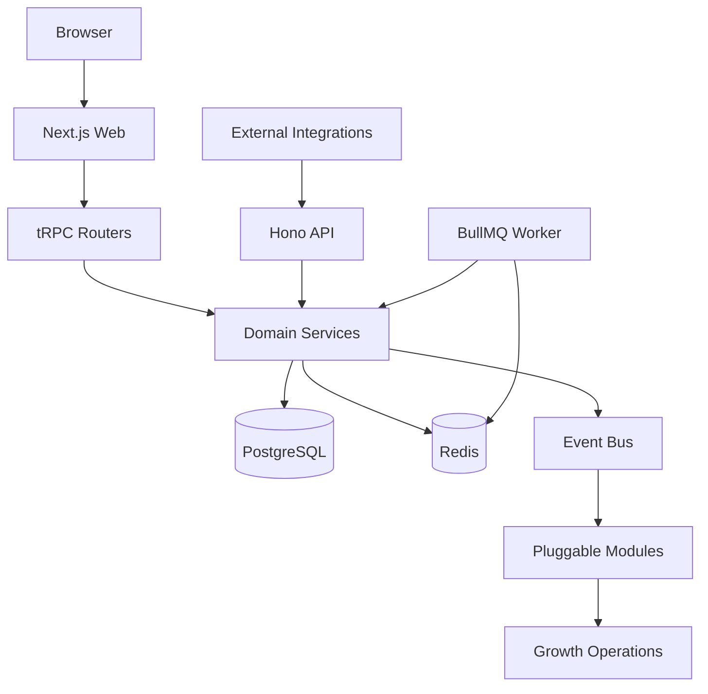
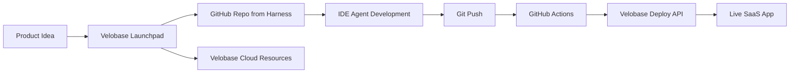

<!-- TODO: Replace with actual hero banner -->
<!-- <p align="center">
  
</p> -->

<h1 align="center">Velobase Harness</h1>

<p align="center">
  <strong>An open-source framework that takes your AI app from code to cash.</strong>
</p>

<p align="center">
  <a href="https://nextjs.org"></a>
  <a href="https://react.dev"></a>
  <a href="https://www.typescriptlang.org"></a>
  <a href="https://pnpm.io"></a>
  <a href="#license"></a>
</p>

<p align="center">
  <a href="https://x.com/VelobaseX"></a>&nbsp;&nbsp;
  <a href="https://discord.gg/HXXWfsx64q"></a>
</p>

<p align="center">
  Help us reach more developers — <a href="https://github.com/velobase/velobase-harness"><strong>Star this repo!</strong></a>
</p>

<p align="center">
  <a href="./README.zh-CN.md">中文</a> · <a href="#quick-start">Quick Start</a> · <a href="#documentation">Docs</a> · <a href="#architecture">Architecture</a>
</p>

---

### Ship fast. Get paid faster.

In the vibe-coding era, everyone can build. But almost none of them make a dollar from it.

We went from the same problem to 8-figure ARR. The secret was not a better product — it was the growth and monetization infrastructure behind it. We just open-sourced all of it. That is Velobase Harness.

<!-- TODO: Replace with product screenshot or demo GIF -->
<!-- <p align="center">
  
</p> -->

## Why Velobase Harness

An open-source AI SaaS framework, extracted from a product doing 8-figure ARR. Unlike every other boilerplate, it does not stop at shipping — it covers the full path from build to revenue.

**📡 Ad Attribution** — Server-side tracking that tells you which ads actually convert. Google Ads offline conversion upload, X pixel, PropellerAds.

**🤝 Affiliate Engine** — Financial-grade double-entry ledger, refund clawback, USDT cashout. Your users become your salesforce.

**💳 Usage-Based Billing** — Full credits lifecycle, subscriptions, multi-currency, metering dashboard, and `@velobaseai/billing` integration. Charges from day one.

**📧 Email Outreach** — A/B testing, scheduled campaigns, dual-provider failover. Brings people back automatically.

**Plus:** Auth & anti-abuse · Multi-LLM AI chat · 11 BullMQ background workers · Stripe & crypto payments · PostHog analytics · Affiliate/Referral · Promo codes · Admin dashboard · Pluggable modules (toggle via env vars) · Docker, Kubernetes & GitOps docs

> We checked every boilerplate on the market. They help you build. **We help you build AND make money.**

## Quick Start

### Option A: Self-hosted local development

```bash
pnpm install
cp .env.example .env
pnpm docker:db:up
pnpm db:push
pnpm db:seed
pnpm dev:all
```

`pnpm dev:all` starts the combined local runtime: Web on `:3000`, API on `:3002`, and Worker on `:3001`.

You can also split processes across terminals:

```bash
pnpm dev
pnpm api:dev
pnpm worker:dev
```

### Option B: Deploy with Velobase Cloud

Velobase Cloud uses this repository as the default application template for Launchpad-created projects.

1. Create a project in Velobase Cloud or start from Launchpad.
2. Cloud creates a GitHub repository from the `velobase-harness` template and provisions PostgreSQL, Redis, R2, Kubernetes resources, domain, and deploy API credentials.
3. Add `VELOBASE_API_KEY` to GitHub Actions secrets.
4. Push to `main`.
5. GitHub Actions calls `GET https://api.velobase.cloud/api/v1/deploy/config`, builds and pushes the Docker image, then calls `POST https://api.velobase.cloud/api/v1/deploy`.
6. Visit `https://{subdomain}.velobase.app` after deployment succeeds.

Application requirements for Cloud deployment:

- A root `Dockerfile`
- HTTP listening on port `3000`
- Environment variables read from runtime env
- Prisma migration through `prisma migrate deploy`
- A `GET /healthz` readiness endpoint

## Architecture



The same codebase can run as one process or as separate services:

| Runtime | Entry | Port | Command |
| --- | --- | --- | --- |
| Web | Next.js App Router | `3000` | `pnpm dev` / `pnpm start` |
| API | Hono HTTP service | `3002` | `pnpm api:dev` / `pnpm api:prod` |
| Worker | BullMQ processors | `3001` | `pnpm worker:dev` / `pnpm worker:prod` |
| Combined | `src/server/standalone.ts` | `3000`, `3002`, `3001` | `pnpm dev:all` / `pnpm start:all` |

`SERVICE_MODE` supports `all`, `web`, `api`, `worker`, and combinations such as `web,api`.

## From Template to Cloud



Launchpad generates an IDE prompt that tells the AI agent how to use the Harness docs, where to implement product features, how to keep framework boundaries intact, and how to push changes back for Cloud deployment.

## Documentation

| Area | English | Chinese |
| --- | --- | --- |
| Documentation hub | [docs/en/README.md](./docs/en/README.md) | [docs/zh-CN/README.md](./docs/zh-CN/README.md) |
| Framework guide | [docs/en/framework-guide.md](./docs/en/framework-guide.md) | [docs/zh-CN/framework-guide.md](./docs/zh-CN/framework-guide.md) |
| Integration guide | [docs/en/integration-guide.md](./docs/en/integration-guide.md) | [docs/zh-CN/integration-guide.md](./docs/zh-CN/integration-guide.md) |
| AI completion checklist | [docs/en/ai-completion-checklist.md](./docs/en/ai-completion-checklist.md) | [docs/zh-CN/ai-completion-checklist.md](./docs/zh-CN/ai-completion-checklist.md) |
| Web/API/Worker split | [docs/en/architecture/web-api-service-split.md](./docs/en/architecture/web-api-service-split.md) | [docs/zh-CN/architecture/web-api-service-split.md](./docs/zh-CN/architecture/web-api-service-split.md) |
| AI agent rules | [AGENTS.md](./AGENTS.md) | [AGENTS.md](./AGENTS.md) |

Legacy Chinese-first docs remain available during migration, including [FRAMEWORK_GUIDE.md](./FRAMEWORK_GUIDE.md), [docs/integration-guide.md](./docs/integration-guide.md), and [docs/ai-completion-checklist.md](./docs/ai-completion-checklist.md).

## Star History

Replace `velobase/velobase-harness` if your public repository lives under a different owner/name.

[](https://star-history.com/#velobase/velobase-harness&Date)

## Project Structure

```text
src/
├── app/              # Next.js pages and API routes
├── api/              # Standalone Hono API entry
├── config/           # Module configuration
├── modules/          # Product modules and templates
├── server/           # Auth, billing, order, events, modules, features
├── workers/          # BullMQ queues and processors
├── components/       # Shared UI components
└── analytics/        # PostHog and ads event tracking
```

## Quality Commands

```bash
pnpm lint
pnpm typecheck
pnpm check
pnpm format:check
pnpm build
```

`package.json` does not define a general unit-test script in this template. Service-mode smoke coverage lives in `docker-compose.test.yml` and `scripts/test-service-mode.mjs`.

## License

[MIT](LICENSE) — use it, fork it, ship it, make money with it.
