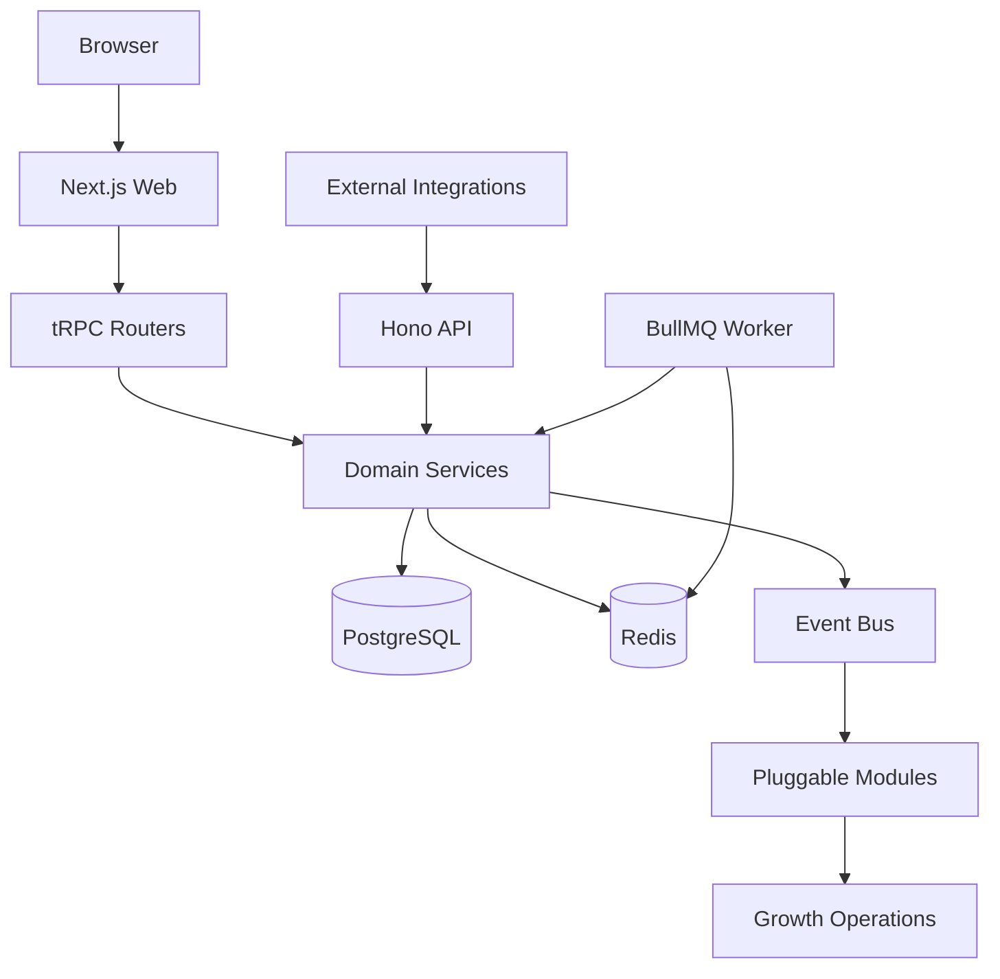
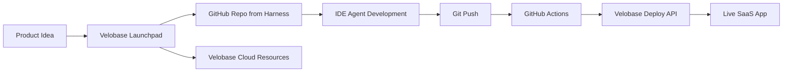

# Velobase Harness

**其他语言:** [English](./README.md)

Velobase Harness 是面向 AI SaaS 的应用框架：T3 Stack 基础、计费与积分、支付、后台任务、增长集成，以及和 Velobase Cloud / Launchpad 打通的部署路径。

[](https://nextjs.org)
[](https://react.dev)
[](https://www.typescriptlang.org)
[](https://pnpm.io)
[](#license)

## 为什么是 Velobase Harness

Velobase Harness 不是空白脚手架，而是一套能直接承接 AI SaaS 产品开发的应用底座。它尽量把通用基础设施、计费、支付、队列、增长和部署路径先解决，让 AI 和开发者把精力放在产品差异化功能上。

- **现代 T3 基础:** Next.js 15、React 19、TypeScript、tRPC、Prisma、NextAuth、Tailwind CSS、pnpm。
- **三服务运行时:** Web、Hono API、BullMQ Worker 可合并运行，也可通过 `SERVICE_MODE` 拆分生产部署。
- **可插拔模块:** Google Ads、PostHog、Lark、Telegram、NowPayments、Affiliate、Touch、AI Chat 可按环境变量启停。
- **计费与积分:** 订单、订阅、积分账本、权益发放、现金流水、优惠码和 `@velobaseai/billing` 已接入。
- **支付就绪:** Stripe 与 NowPayments 覆盖 Webhook、续费、退款、争议和补偿任务。
- **AI Chat 模块:** 提供对话、模型配置、工具调用和业务工具扩展点。
- **Worker 队列:** BullMQ 处理支付对账、订单补偿、用户触达、订阅积分、客服同步和广告回传。
- **运营增长能力:** PostHog 分析、Google Ads 离线转化回传、Affiliate/Referral、Touch 生命周期触达、Daily Bonus 留存、Promo Code、SEO 和 Launchpad 转化路径。
- **生产文档:** Docker、Kubernetes、GitOps、Cloud Deploy API、线上到本地 Debug、AI 完成检查清单。

## 快速开始

### 方式 A: 本地自托管开发

```bash
pnpm install
cp .env.example .env
pnpm docker:db:up
pnpm db:push
pnpm db:seed
pnpm dev:all
```

`pnpm dev:all` 会启动本地组合运行时：Web `:3000`、API `:3002`、Worker `:3001`。

也可以拆分到多个终端启动：

```bash
pnpm dev
pnpm api:dev
pnpm worker:dev
```

### 方式 B: 使用 Velobase Cloud 部署

Velobase Cloud 会把本仓库作为 Launchpad 创建项目时的默认应用模板。

1. 在 Velobase Cloud 创建项目，或从 Launchpad 输入产品想法开始。
2. Cloud 基于 `velobase-harness` 模板创建 GitHub 仓库，并开通 PostgreSQL、Redis、R2、Kubernetes 资源、域名和部署 API 凭证。
3. 在 GitHub Actions Secret 中配置 `VELOBASE_API_KEY`。
4. Push 到 `main` 分支。
5. GitHub Actions 调用 `GET https://api.velobase.cloud/api/v1/deploy/config` 获取镜像仓库信息，构建并推送 Docker 镜像，再调用 `POST https://api.velobase.cloud/api/v1/deploy`。
6. 部署成功后访问 `https://{subdomain}.velobase.app`。

Cloud 部署要求应用满足：

- 根目录提供 `Dockerfile`
- HTTP 监听 `3000` 端口
- 从运行时环境变量读取配置
- 通过 `prisma migrate deploy` 执行迁移
- 提供 `GET /healthz` 就绪检查

## 架构



同一套代码可以单进程运行，也可以拆分为独立服务：

| 运行时 | 入口 | 端口 | 命令 |
| --- | --- | --- | --- |
| Web | Next.js App Router | `3000` | `pnpm dev` / `pnpm start` |
| API | Hono HTTP 服务 | `3002` | `pnpm api:dev` / `pnpm api:prod` |
| Worker | BullMQ 处理器 | `3001` | `pnpm worker:dev` / `pnpm worker:prod` |
| 组合模式 | `src/server/standalone.ts` | `3000`, `3002`, `3001` | `pnpm dev:all` / `pnpm start:all` |

`SERVICE_MODE` 支持 `all`、`web`、`api`、`worker`，以及 `web,api` 等组合。

## 从模板到云服务



Launchpad 会生成一段 IDE Prompt，引导 AI Agent 阅读 Harness 文档、理解框架边界、实现产品功能，并在完成后 push 触发 Cloud 部署。

## 文档

| 主题 | English | 中文 |
| --- | --- | --- |
| 文档中心 | [docs/en/README.md](./docs/en/README.md) | [docs/zh-CN/README.md](./docs/zh-CN/README.md) |
| 框架指南 | [docs/en/framework-guide.md](./docs/en/framework-guide.md) | [docs/zh-CN/framework-guide.md](./docs/zh-CN/framework-guide.md) |
| 集成指南 | [docs/en/integration-guide.md](./docs/en/integration-guide.md) | [docs/zh-CN/integration-guide.md](./docs/zh-CN/integration-guide.md) |
| AI 完成检查清单 | [docs/en/ai-completion-checklist.md](./docs/en/ai-completion-checklist.md) | [docs/zh-CN/ai-completion-checklist.md](./docs/zh-CN/ai-completion-checklist.md) |
| Web/API/Worker 拆分 | [docs/en/architecture/web-api-service-split.md](./docs/en/architecture/web-api-service-split.md) | [docs/zh-CN/architecture/web-api-service-split.md](./docs/zh-CN/architecture/web-api-service-split.md) |
| AI Agent 规则 | [AGENTS.md](./AGENTS.md) | [AGENTS.md](./AGENTS.md) |

迁移期间，旧的中文优先文档仍然保留，包括 [FRAMEWORK_GUIDE.md](./FRAMEWORK_GUIDE.md)、[docs/integration-guide.md](./docs/integration-guide.md) 和 [docs/ai-completion-checklist.md](./docs/ai-completion-checklist.md)。

## Star History

如果公开仓库不是 `velobase/velobase-harness`，请替换下方 owner/repo。

[](https://star-history.com/#velobase/velobase-harness&Date)

## 项目结构

```text
src/
├── app/              # Next.js 页面和 API routes
├── api/              # 独立 Hono API 入口
├── config/           # 模块配置
├── modules/          # 产品模块和示例模板
├── server/           # Auth、billing、order、events、modules、features
├── workers/          # BullMQ 队列和处理器
├── components/       # 共享 UI 组件
└── analytics/        # PostHog 和广告事件追踪
```

## 质量命令

```bash
pnpm lint
pnpm typecheck
pnpm check
pnpm format:check
pnpm build
```

当前模板的 `package.json` 没有统一单元测试脚本。服务模式冒烟验证在 `docker-compose.test.yml` 和 `scripts/test-service-mode.mjs` 中。

## License

Private - All rights reserved.
