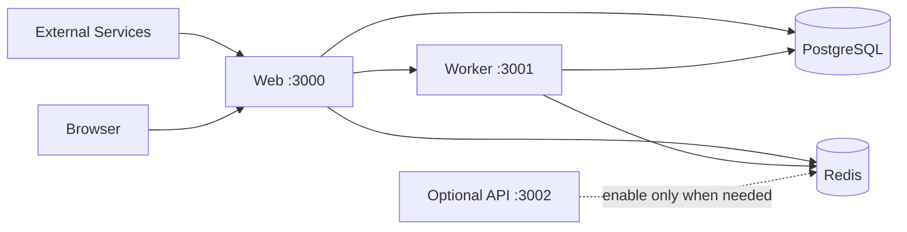

# Web, API, And Worker Split

Velobase Harness is designed around three runtime boundaries, but the default deployment path is **Web + Worker**. The standalone Hono API service is an optional extension point, not required for the current production integrations.

## Service Types

| Service | Responsibility | Entry | Typical Port | Default |
| --- | --- | --- | --- | --- |
| Web | Next.js App Router, pages, tRPC, Next Route Handlers, auth, current production webhooks | Next production server or `src/web/start.ts` | `3000` | On |
| Worker | BullMQ processors, schedulers, retryable side effects, reconciliation jobs | `src/workers/index.ts` | `3001` | On |
| API | Optional standalone Hono HTTP service for future external REST APIs or isolated webhook ingress | `src/api/index.ts` | `3002` | Off |
| Combined | One Node process that starts the selected runtimes from `SERVICE_MODE` | `src/server/standalone.ts` | multiple | Web + Worker |

Current Hono API routes are intentionally minimal:

- `GET /health`
- `GET /ready`
- `POST /webhooks/example`

Stripe, NowPayments, Telegram, Resend, Lark, NextAuth, AI Chat, and tRPC HTTP entrypoints currently live under `src/app/api/**` and run in the Web service.

## `SERVICE_MODE`

`SERVICE_MODE` controls which runtime starts:

- `web,worker`: default Web + Worker runtime.
- `web`: start only Web. Webhooks still work, but background jobs do not run.
- `worker`: start only Worker. Queues run, but no HTTP app is exposed.
- `api`: start only the optional Hono API.
- `all`: explicitly start Web, API, and Worker.
- `web,api`, `web,api,worker`, or other comma-separated combinations: start selected services together.

`pnpm dev:all` and `pnpm start:all` start `src/server/standalone.ts`; the actual runtimes are still chosen by `SERVICE_MODE`.

## Default Deployment

Default production deployments should run Web + Worker:

Use Web for user traffic, tRPC, auth, AI Chat HTTP, and the current production webhooks. Use Worker for retries, scheduled jobs, payment reconciliation, support mail processing, ads uploads, and other asynchronous work.

## When To Enable API

Enable the Hono API service only when it has real routes to serve. Typical reasons:

- You have a large volume of external webhooks and do not want them to hit Web pods.
- You expose a public REST API that needs separate rate limits, authentication, or scaling.
- Webhook handling must stay extremely thin and independently available from the Web app.
- API and Web need different release frequency, resource limits, or autoscaling rules.

Do not enable API just because the framework has an API directory. With the current template, disabling API does not break the existing third-party integrations.

## Re-Enable API

To re-enable API service:

1. Add real Hono routes under `src/api/routes/*` and mount them from `src/api/app.ts`.
2. Set `SERVICE_MODE=api` for a dedicated API deployment, or use `SERVICE_MODE=all`, `web,api`, or `web,api,worker` for combined modes.
3. Expose port `3002` in Docker/Kubernetes and use `/health` for liveness and `/ready` for readiness.
4. For Velobase Cloud workflow deploys, update the active workflow: use `.github/workflows/deploy-velobase-multi.yml` for split services, add an API service entry with `mode: "api"`, `port: 3002`, and `health: "/health"`, and ensure the inactive deployment workflow does not also run on `push`.
5. Keep `exposed_service` as `web` unless the primary domain should route to the API service.

## Code Boundary Rules

- Hono API code must not import Next.js-only APIs such as `next/headers` or `next/server`.
- Next Route Handlers under `src/app/api/**` are Web runtime routes.
- Worker code must not depend on request-scoped Next.js APIs.
- Shared business logic belongs in services that can run in Web, API, or Worker.
- Side effects that need retries should go through queues.
- Keep health and readiness behavior explicit for every enabled service.
