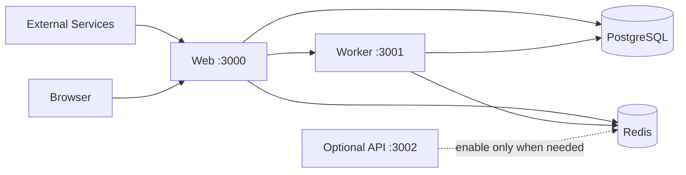

# Web、API 与 Worker 拆分

Velobase Harness 按三个 runtime 边界设计，但默认部署路径是 **Web + Worker**。独立 Hono API 服务是可选扩展点，不是当前生产集成的必需服务。

## 服务类型

| 服务 | 职责 | 入口 | 常见端口 | 默认 |
| --- | --- | --- | --- | --- |
| Web | Next.js App Router、页面、tRPC、Next Route Handlers、认证、当前生产 webhook | Next production server 或 `src/web/start.ts` | `3000` | 启用 |
| Worker | BullMQ processors、schedulers、可重试副作用、对账任务 | `src/workers/index.ts` | `3001` | 启用 |
| API | 可选独立 Hono HTTP 服务，用于未来外部 REST API 或隔离 webhook 入口 | `src/api/index.ts` | `3002` | 禁用 |
| Combined | 根据 `SERVICE_MODE` 在一个 Node 进程中启动选定 runtime | `src/server/standalone.ts` | 多端口 | Web + Worker |

当前 Hono API route 有意保持极少：

- `GET /health`
- `GET /ready`
- `POST /webhooks/example`

Stripe、NowPayments、Telegram、Resend、Lark、NextAuth、AI Chat 和 tRPC HTTP 入口当前都在 `src/app/api/**` 下，由 Web 服务承接。

## `SERVICE_MODE`

`SERVICE_MODE` 控制启动哪些 runtime：

- `web,worker`：默认 Web + Worker runtime。
- `web`：只启动 Web。Webhook 仍可用，但后台任务不会运行。
- `worker`：只启动 Worker。队列会运行，但不暴露 HTTP 应用。
- `api`：只启动可选 Hono API。
- `all`：显式启动 Web、API 和 Worker。
- `web,api`、`web,api,worker` 或其他逗号分隔组合：组合启动指定服务。

`pnpm dev:all` 和 `pnpm start:all` 启动的是 `src/server/standalone.ts`；实际启动哪些 runtime 仍由 `SERVICE_MODE` 决定。

## 默认部署

默认生产部署应运行 Web + Worker：

Web 承接用户流量、tRPC、认证、AI Chat HTTP 和当前生产 webhook。Worker 承接重试、定时任务、支付对账、客服邮件处理、广告上传和其他异步工作。

## 何时启用 API

只有当 Hono API 有真实 route 需要承载时才启用 API 服务。典型场景：

- 有大量外部 webhook，不想打到 Web pod。
- 有公开 REST API，需要独立限流、鉴权或扩容。
- Webhook 处理必须保持极轻量，并且要独立于 Web 应用可用。
- API 和 Web 需要不同的发布频率、资源限制或自动扩缩容规则。

不要因为框架有 API 目录就默认启用 API。当前模板下，禁用 API 不会影响已有三方集成。

## 重新启用 API

重新启用 API 服务：

1. 在 `src/api/routes/*` 下新增真实 Hono route，并从 `src/api/app.ts` 挂载。
2. 独立 API 部署设置 `SERVICE_MODE=api`，组合模式可使用 `SERVICE_MODE=all`、`web,api` 或 `web,api,worker`。
3. 在 Docker/Kubernetes 暴露 `3002`，使用 `/health` 做 liveness、`/ready` 做 readiness。
4. Velobase Cloud 多服务部署时，增加 `mode: "api"`、`port: 3002`、`health: "/health"` 的 API service。
5. 除非主域名确实要路由到 API，否则 `exposed_service` 仍保持为 `web`。

## 代码边界规则

- Hono API 代码不要导入 `next/headers`、`next/server` 等 Next.js-only APIs。
- `src/app/api/**` 下的 Next Route Handlers 属于 Web runtime。
- Worker 代码不要依赖 request-scoped Next.js APIs。
- 共享业务逻辑放在 Web、API、Worker 都能运行的 services 中。
- 需要重试的副作用走队列。
- 每个启用服务的 health 和 readiness 行为都要明确。
